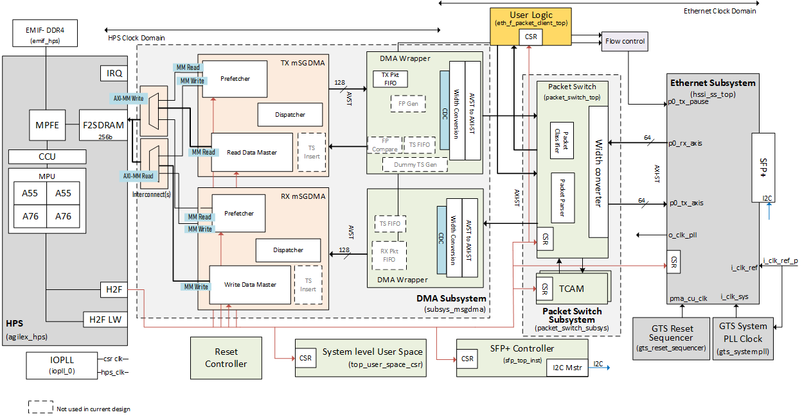

# Intel® Agilex™ 5 Ethernet System Example Design


## Description
The Ethernet System Example Design demonstrates Ethernet functionality of the Altera Agilex 5 FPGA 
supporting FTile transceivers. It provides a 1-Port, 10GbE design leveraging the Ethernet Intel® FPGA IP

The primary components in the design are
- Hard Processor Subsystem (HPS)
- Channelized Modular scatter-Gather Direct Memory Access (MSGDMA) Subsystem
- Packet Switch module
- Packet Generator
- Ethernet MAC IP




Important features of the design include
- Ethernet Software stack running on the HPS that handles the generation of iperf traffic
- Programmable packet routing functionality handled within the Packet Switch module
- DMA engines to efficiently transfer data between the HPS and Ethernet MAC

For more information, refer to the [altera github doc](https://altera-fpga.github.io/rel-26.1/embedded-designs/agilex-5/e-series/modular-065b/ethernet/agx5e-ethernet-10g/ug-agx5e-ethernet-10g/).


## Repository Structure

Directory Structure used in this example design:

 ```bash
    |--- a5e065b-mod-devkit-exp-prod/src
    |   |--- hw
    |   |--- sw
 ```
 
 

## Project Details

- **Family**: Agilex™ 5
- **Quartus Version**: 26.1
- **Development Kit**: [Agilex™ 5 FPGA E-Series 065B Modular Development Kit (MK-A5E065BB32AEA)](https://www.altera.com/products/devkit/po-3274/agilex-5-fpga-and-soc-e-series-065b-modular-development-kit)
- **Device Part**: A5ED065BB32AE4S

## Getting Started

Building the design is easy with the scripts provided in the repo. Clone the repository to get the source files
	
	$ git clone https://github.com/altera-fpga/agilex5-ed-ethernet.git
	$ cd agilex5-ed-ethernet
	$ git checkout SED-1x10GE-a5e065b-mdk-Q26.1-Rel-1.1


Follow the below procedure to build the HW and the Software artifacts. 
- [Building the hardware](a5e065b-mod-devkit-exp-prod/src/hw/README.md)
- [Building the software](a5e065b-mod-devkit-exp-prod/src/sw/README.md)

**NOTE**: Kindly refer to this [Release Q25.3-Rel-1.1](https://github.com/altera-fpga/agilex5-ed-ethernet/releases/tag/SED-1x10GE-a5e065b-mdk-Q25.3-Rel-1.1) for Design targetted to [Agilex™ 5 FPGA and SoC E-Series Modular Development Kit (ES)](https://www.altera.com/products/devkit/po-3001/agilex-5-fpga-and-soc-e-series-modular-development-kit-es)
